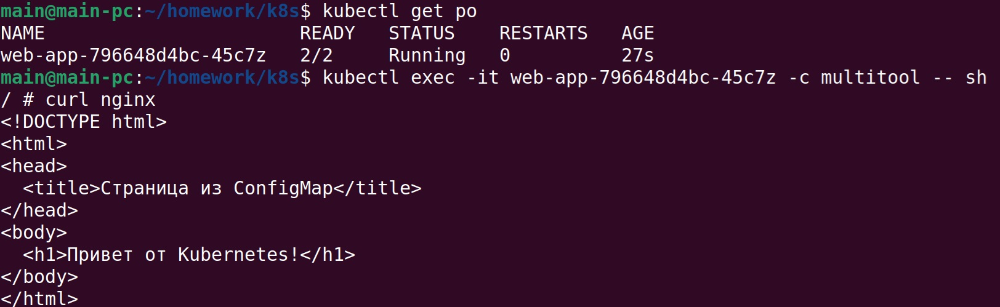
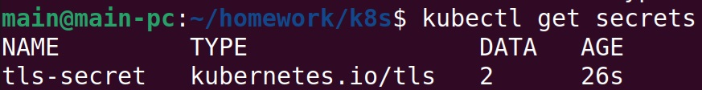
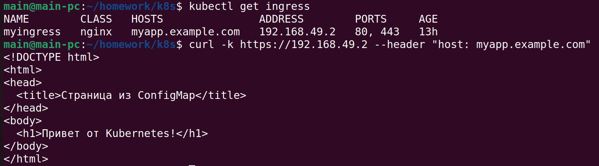
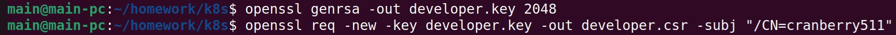
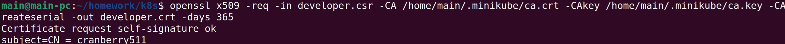
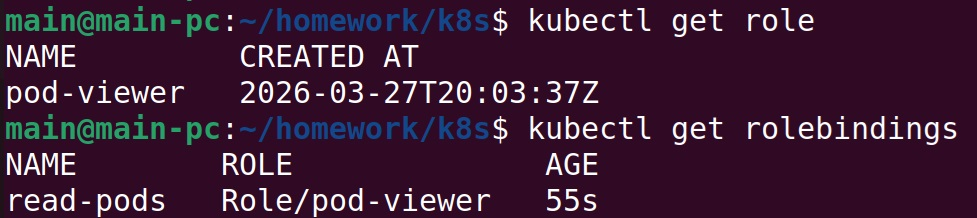
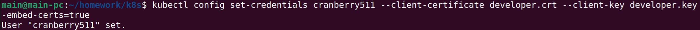
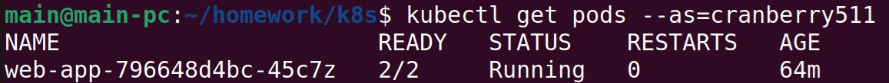

## Решение задания 1

Создание Deployment приложения, состоящего из двух контейнеров и подключение веб-страницы через ConfigMap:   
https://github.com/cranberry511/kuber-homeworks_2.3/blob/main/deployment.yaml   
https://github.com/cranberry511/kuber-homeworks_2.3/blob/main/configmap-web.yaml   

Проверка доступности:

## Решение задания 2

Создание Secret:   
https://github.com/cranberry511/kuber-homeworks_2.3/blob/main/secret-tls.yaml

Настройка Ingress и проверка HTTPS-доступа:   
https://github.com/cranberry511/kuber-homeworks_2.3/blob/main/ingress-tls.yaml

## Решение задания 3

Создание SSL-сертификата для пользователя:   

Создание Role и RoleBinding:   
https://github.com/cranberry511/kuber-homeworks_2.3/blob/main/role-pod-reader.yaml
https://github.com/cranberry511/kuber-homeworks_2.3/blob/main/rolebinding-developer.yaml

Проверка доступа:   

